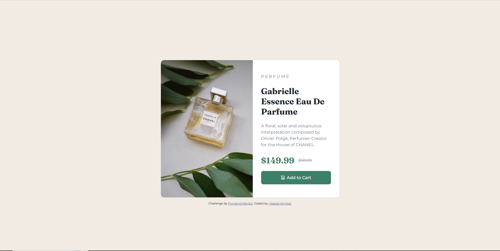

# Frontend Mentor - Product preview card component solution

This is a solution to the [Product preview card component challenge on Frontend Mentor](https://www.frontendmentor.io/challenges/product-preview-card-component-GO7UmttRfa). Frontend Mentor challenges help you improve your coding skills by building realistic projects. 

## Table of contents

- [Overview](#overview)
  - [The challenge](#the-challenge)
  - [Screenshot](#screenshot)
  - [Links](#links)
- [My process](#my-process)
  - [Built with](#built-with)
  - [What I learned](#what-i-learned)
  - [Continued development](#continued-development)
  - [Useful resources](#useful-resources)
  - [AI Collaboration](#ai-collaboration)
- [Author](#author)

**Note: Delete this note and update the table of contents based on what sections you keep.**

## Overview

### The challenge

Users should be able to:

- View the optimal layout depending on their device's screen size
- See hover and focus states for interactive elements

### Screenshot



### Links

- Solution URL: [solution URL](https://github.com/haseebs-codes/Product-preview-card-component)
- Live Site URL: [live site](https://haseebs-codes.github.io/Product-preview-card-component/)

## My process

### Built with

- Semantic HTML5 markup
- CSS custom properties
- Flexbox
- CSS Grid
- Mobile-first workflow
- Scss


### What I learned

I learned how to use scss and how to use css grid properly 


```css
@media screen and (min-width: 40rem) {
  .product-preview-card-container{
    grid-template-columns: 350px minmax(200px, 330px);

    
    & picture,
     .product-img{
      border-top-right-radius: 0;
      object-fit: cover;
    }

    & .product-info-container{
      align-self: center;
    }
  }
}
```


### Continued development

In future projects ill be focusing on bettering my scss skills and use them more accurately along side with transitions and animations  

### Useful resources

- [Web Dev](https://web.dev/learn/design/picture-element) - This helped me for how to align and adjust the pictures and use picture element. I really liked this pattern and will use it going forward.
- [Web Dev](https://web.dev/learn/design/responsive-images#constrain) - This is an amazing article which helped me finally understand how to make images responsive. I'd recommend it to anyone still learning this concept.


### AI Collaboration

Describe how you used AI tools (if any) during this project. This helps demonstrate your ability to work effectively with AI assistants.

- I used Claude code for this project but heres thge thing that most peaople in my opnion dont know, claude code is really a powerfull tool but sometimes it wont provide the help you need after all its just a machine but i used it mainly for the alignments of the text which it was not getting my point and was trying to make me look it diffrent places rather than the place that need the attention 

## Author

- Frontend Mentor - [@yhaseebs-codes](https://www.frontendmentor.io/profile/haseebs-codes)

